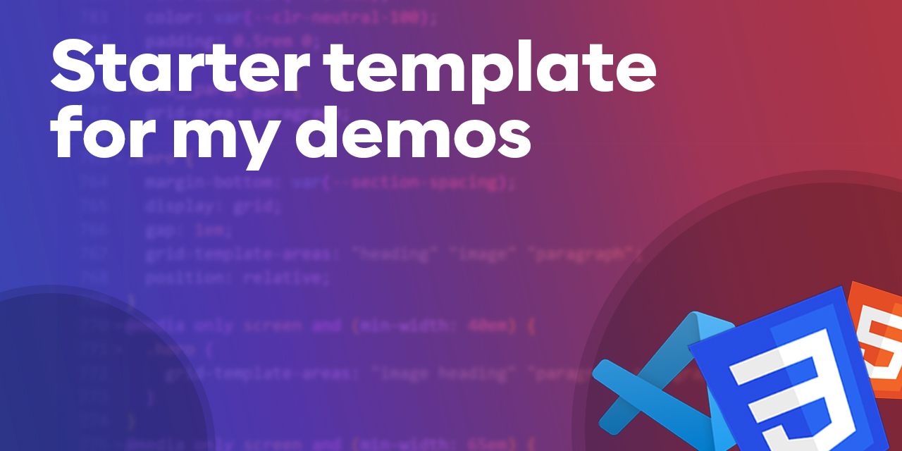

# demo-template
A CSS "framework" that I'm using for my demos.

I am using Sass to generate a CSS file, which I can quickly use to put together my demo files for YouTube videos.

This is a work in progress.
